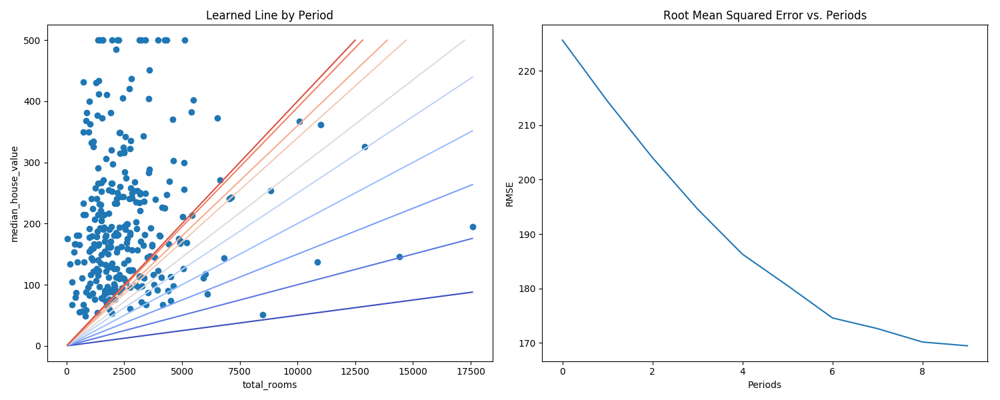
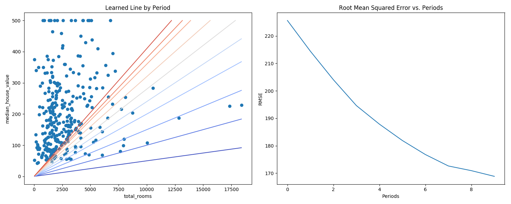
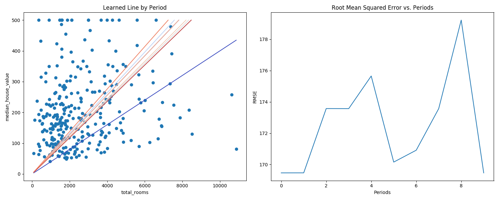

# Before reforming the code

The hyper parameters are:

* learning rate = 0.0000001
* steps = 100
* batch size = 1

```
Mean Squared Error (on training data): 56367.025
Root Mean Squared Error (on training data): 237.417
Min of Median House Value: 14.999
Max of Median House Value: 500.001
Difference between Min and Max: 485.002
```


# Tweaking the hyper parameters

## Tweak 01

* learning rate = 0.00001
* steps = 100
* batch size = 1


## Tweak 02: Increasing learning rate

* learning rate = 0.0001
* steps = 100
* batch size = 1

```
Training model...
RMSE (on training data):
  period 00 : 225.63
  period 01 : 214.42
  period 02 : 204.04
  period 03 : 194.62
  period 04 : 186.29
  period 05 : 180.53
  period 06 : 174.58
  period 07 : 172.62
  period 08 : 170.16
  period 09 : 169.46
Model training finished.

Statics for prediction and target:
        predictions       targets
count  17000.000000  17000.000000
mean     105.746521    207.300912
std       87.197815    115.983764
min        0.080028     14.999000
25%       58.479980    119.400000
50%       85.079964    180.400000
75%      126.049932    265.000000
max     1517.478882    500.001000
Final RMSE (on training data): 169.46
```



## Tweak 03: Increasing batch size

* learning rate = 0.0001
* steps = 100
* batch size = 5

```
Training model...
RMSE (on training data):
  period 00 : 225.63
  period 01 : 214.42
  period 02 : 204.04
  period 03 : 194.62
  period 04 : 187.86
  period 05 : 181.89
  period 06 : 176.79
  period 07 : 172.62
  period 08 : 170.91
  period 09 : 168.84
Model training finished.

Statics for prediction and target:
        predictions       targets
count  17000.000000  17000.000000
mean     108.390091    207.300912
std       89.377670    115.983764
min        0.082038     14.999000
25%       59.941933    119.400000
50%       87.206879    180.400000
75%      129.201061    265.000000
max     1555.414185    500.001000
Final RMSE (on training data): 168.84
```



## Tweak 04: More Steps

* learning rate = 0.0001
* steps = 1000
* batch size = 5

```
Training model...
RMSE (on training data):
  period 00 : 169.46
  period 01 : 169.47
  period 02 : 173.57
  period 03 : 173.57
  period 04 : 175.65
  period 05 : 170.15
  period 06 : 170.91
  period 07 : 173.57
  period 08 : 179.23
  period 09 : 169.46
Model training finished.

Statics for prediction and target:
        predictions       targets
count  17000.000000  17000.000000
mean     155.965073    207.300912
std      128.607300    115.983764
min        0.118478     14.999000
25%       86.252068    119.400000
50%      125.484146    180.400000
75%      185.910397    265.000000
max     2238.116943    500.001000
Final RMSE (on training data): 169.46
```



The RMSE doesn't seem to be converging.