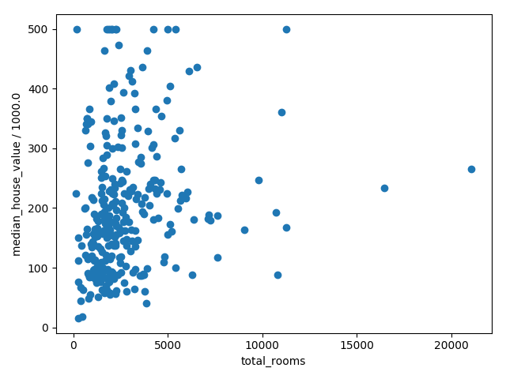
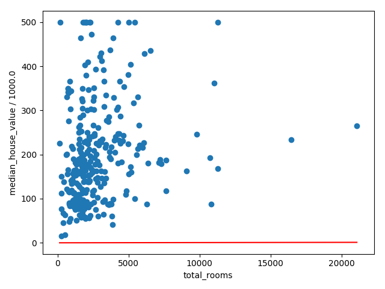
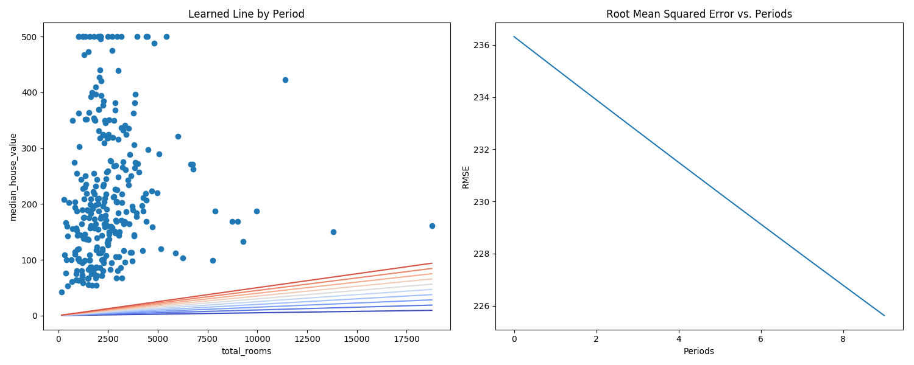

# Before reforming the code

The hyper parameters are:

* learning rate = 0.0000001
* steps = 100
* batch size = 1

```
Mean Squared Error (on training data): 56367.025
Root Mean Squared Error (on training data): 237.417
Min of Median House Value: 14.999
Max of Median House Value: 500.001
Difference between Min and Max: 485.002
```





# Tweaking the hyper parameters

## Tweak 01

* learning rate = 0.00001
* steps = 100
* batch size = 1

