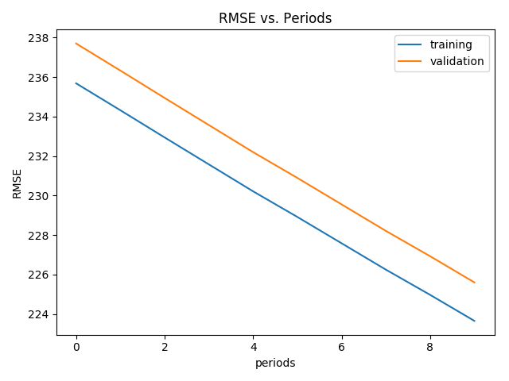
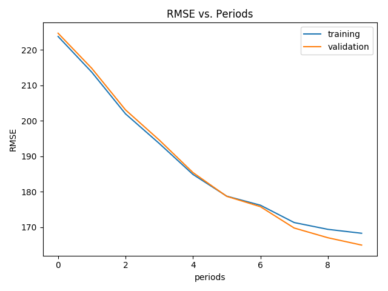
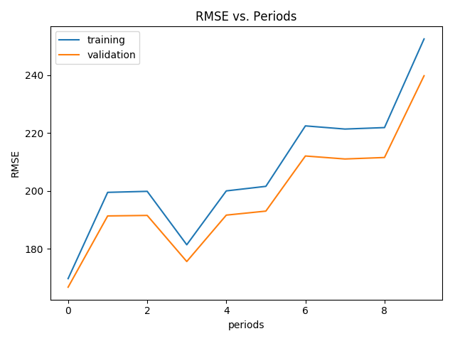
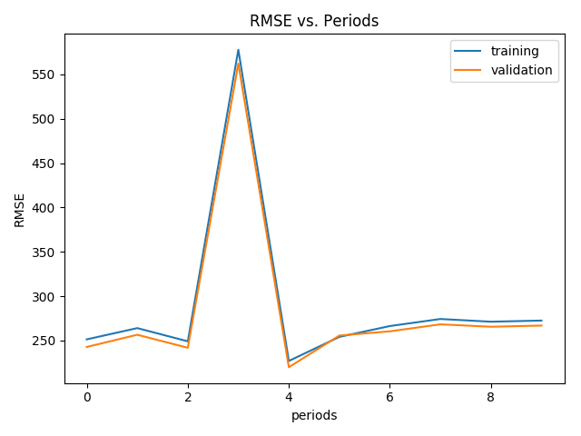
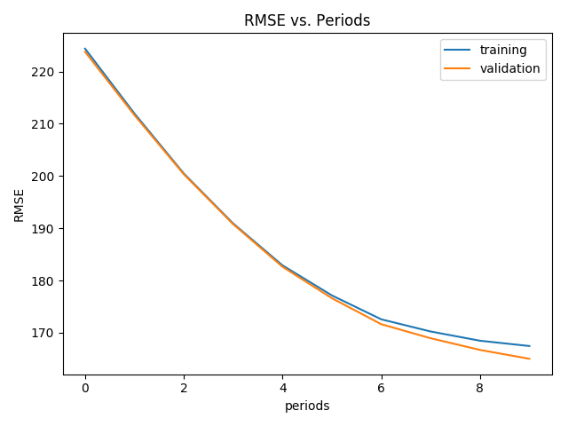
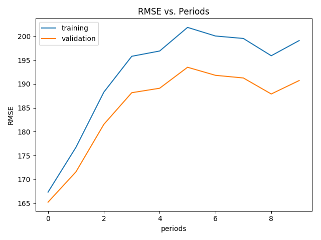
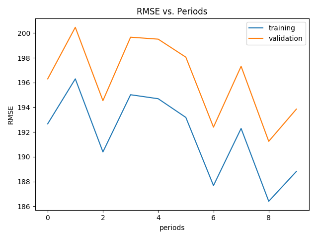
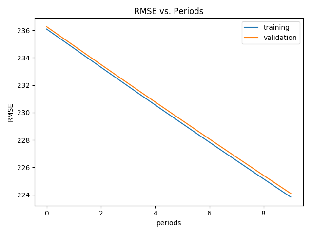
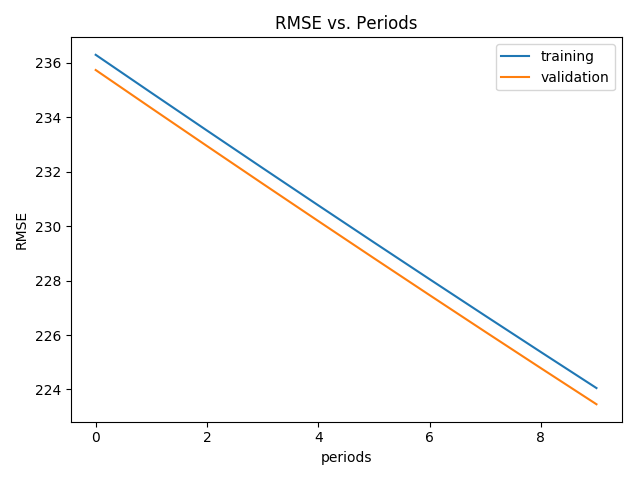
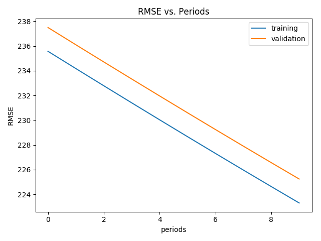

# The Data Distribution


# Tweaking the hyper-parameters

## Tweak 01:

* learning_rate=0.00001
* steps=100
* batch_size=1

```
Training model...
  period 00: Training RMSE=235.68, Validation RMSE=237.70
  period 01: Training RMSE=234.32, Validation RMSE=236.33
  period 02: Training RMSE=232.94, Validation RMSE=234.94
  period 03: Training RMSE=231.58, Validation RMSE=233.57
  period 04: Training RMSE=230.21, Validation RMSE=232.20
  period 05: Training RMSE=228.91, Validation RMSE=230.89
  period 06: Training RMSE=227.58, Validation RMSE=229.55
  period 07: Training RMSE=226.25, Validation RMSE=228.21
  period 08: Training RMSE=224.97, Validation RMSE=226.92
  period 09: Training RMSE=223.65, Validation RMSE=225.60
Model training has finished.
RMSE on test data: 221.54
```



## Tweak 02: increasing the learning rate

* learning_rate=0.0001
* steps=100
* batch_size=1

```
Training model...
  period 00: Training RMSE=223.78, Validation RMSE=224.70
  period 01: Training RMSE=213.70, Validation RMSE=214.78
  period 02: Training RMSE=201.95, Validation RMSE=203.06
  period 03: Training RMSE=193.60, Validation RMSE=194.56
  period 04: Training RMSE=184.86, Validation RMSE=185.39
  period 05: Training RMSE=178.74, Validation RMSE=178.69
  period 06: Training RMSE=176.18, Validation RMSE=175.76
  period 07: Training RMSE=171.29, Validation RMSE=169.75
  period 08: Training RMSE=169.37, Validation RMSE=167.00
  period 09: Training RMSE=168.27, Validation RMSE=164.93
Model training has finished.
RMSE on test data: 161.90
```



## Tweak 03: increasing the learning rate

* learning_rate=0.001
* steps=100
* batch_size=1

```
Training model...
  period 00: Training RMSE=169.68, Validation RMSE=166.72
  period 01: Training RMSE=199.49, Validation RMSE=191.35
  period 02: Training RMSE=199.84, Validation RMSE=191.52
  period 03: Training RMSE=181.39, Validation RMSE=175.59
  period 04: Training RMSE=200.00, Validation RMSE=191.63
  period 05: Training RMSE=201.57, Validation RMSE=193.01
  period 06: Training RMSE=222.46, Validation RMSE=212.06
  period 07: Training RMSE=221.36, Validation RMSE=211.03
  period 08: Training RMSE=221.87, Validation RMSE=211.53
  period 09: Training RMSE=252.50, Validation RMSE=239.78
Model training has finished.
RMSE on test data: 238.15
```



## Tweak 04: increasing the learning rate

* learning_rate=0.01
* steps=100
* batch_size=1

```
Training model...
  period 00: Training RMSE=251.27, Validation RMSE=242.71
  period 01: Training RMSE=263.96, Validation RMSE=256.49
  period 02: Training RMSE=249.06, Validation RMSE=241.80
  period 03: Training RMSE=577.78, Validation RMSE=562.30
  period 04: Training RMSE=226.95, Validation RMSE=219.90
  period 05: Training RMSE=254.06, Validation RMSE=255.60
  period 06: Training RMSE=266.29, Validation RMSE=260.33
  period 07: Training RMSE=274.24, Validation RMSE=268.23
  period 08: Training RMSE=271.18, Validation RMSE=265.49
  period 09: Training RMSE=272.48, Validation RMSE=266.85
Model training has finished.
RMSE on test data: 268.91
```



## Tweak 05: increasing the steps

* learning_rate=0.00001
* steps=1000
* batch_size=1

```
Training model...
  period 00: Training RMSE=224.37, Validation RMSE=223.78
  period 01: Training RMSE=211.97, Validation RMSE=211.66
  period 02: Training RMSE=200.48, Validation RMSE=200.33
  period 03: Training RMSE=190.91, Validation RMSE=190.78
  period 04: Training RMSE=182.89, Validation RMSE=182.62
  period 05: Training RMSE=177.13, Validation RMSE=176.60
  period 06: Training RMSE=172.56, Validation RMSE=171.63
  period 07: Training RMSE=170.23, Validation RMSE=168.94
  period 08: Training RMSE=168.46, Validation RMSE=166.70
  period 09: Training RMSE=167.45, Validation RMSE=165.01
Model training has finished.
RMSE on test data: 161.17
```



## Tweak 06: continue increasing the steps

* learning_rate=0.00001
* steps=10000
* batch_size=1

```
Training model...
  period 00: Training RMSE=167.35, Validation RMSE=165.24
  period 01: Training RMSE=176.73, Validation RMSE=171.59
  period 02: Training RMSE=188.29, Validation RMSE=181.54
  period 03: Training RMSE=195.79, Validation RMSE=188.16
  period 04: Training RMSE=196.90, Validation RMSE=189.10
  period 05: Training RMSE=201.84, Validation RMSE=193.50
  period 06: Training RMSE=200.04, Validation RMSE=191.81
  period 07: Training RMSE=199.53, Validation RMSE=191.25
  period 08: Training RMSE=195.91, Validation RMSE=187.90
  period 09: Training RMSE=199.09, Validation RMSE=190.71
Model training has finished.
RMSE on test data: 187.78
```



## Tweak 07: continue increasing the steps

* learning_rate=0.00001
* steps=100000
* batch_size=1

```
Training model...
  period 00: Training RMSE=192.66, Validation RMSE=196.29
  period 01: Training RMSE=196.30, Validation RMSE=200.46
  period 02: Training RMSE=190.40, Validation RMSE=194.54
  period 03: Training RMSE=195.02, Validation RMSE=199.66
  period 04: Training RMSE=194.69, Validation RMSE=199.50
  period 05: Training RMSE=193.18, Validation RMSE=198.05
  period 06: Training RMSE=187.68, Validation RMSE=192.40
  period 07: Training RMSE=192.29, Validation RMSE=197.31
  period 08: Training RMSE=186.41, Validation RMSE=191.25
  period 09: Training RMSE=188.82, Validation RMSE=193.85
Model training has finished.
RMSE on test data: 184.57
```

It is bouncing. Very clear.



## Tweak 08: increasing the batch size

* learning_rate=0.00001
* steps=100
* batch_size=10

```
Training model...
  period 00: Training RMSE=236.08, Validation RMSE=236.26
  period 01: Training RMSE=234.70, Validation RMSE=234.88
  period 02: Training RMSE=233.31, Validation RMSE=233.50
  period 03: Training RMSE=231.93, Validation RMSE=232.13
  period 04: Training RMSE=230.55, Validation RMSE=230.77
  period 05: Training RMSE=229.19, Validation RMSE=229.42
  period 06: Training RMSE=227.84, Validation RMSE=228.07
  period 07: Training RMSE=226.49, Validation RMSE=226.74
  period 08: Training RMSE=225.16, Validation RMSE=225.41
  period 09: Training RMSE=223.84, Validation RMSE=224.10
Model training has finished.
RMSE on test data: 221.22
```



## Tweak 09: continue increasing the batch size

* learning_rate=0.00001
* steps=100
* batch_size=100

```
Training model...
  period 00: Training RMSE=236.30, Validation RMSE=235.74
  period 01: Training RMSE=234.90, Validation RMSE=234.34
  period 02: Training RMSE=233.52, Validation RMSE=232.95
  period 03: Training RMSE=232.14, Validation RMSE=231.56
  period 04: Training RMSE=230.77, Validation RMSE=230.19
  period 05: Training RMSE=229.41, Validation RMSE=228.82
  period 06: Training RMSE=228.05, Validation RMSE=227.47
  period 07: Training RMSE=226.71, Validation RMSE=226.12
  period 08: Training RMSE=225.38, Validation RMSE=224.78
  period 09: Training RMSE=224.05, Validation RMSE=223.46
Model training has finished.
RMSE on test data: 221.19
```



## Tweak 10: continue increasing the batch size

* learning_rate=0.00001
* steps=100
* batch_size=1000

```
  period 00: Training RMSE=235.57, Validation RMSE=237.49
  period 01: Training RMSE=234.17, Validation RMSE=236.09
  period 02: Training RMSE=232.78, Validation RMSE=234.71
  period 03: Training RMSE=231.40, Validation RMSE=233.33
  period 04: Training RMSE=230.03, Validation RMSE=231.96
  period 05: Training RMSE=228.66, Validation RMSE=230.59
  period 06: Training RMSE=227.31, Validation RMSE=229.24
  period 07: Training RMSE=225.96, Validation RMSE=227.90
  period 08: Training RMSE=224.63, Validation RMSE=226.56
  period 09: Training RMSE=223.30, Validation RMSE=225.24
Model training has finished.
RMSE on test data: 221.19
```

It runs very slow and consumes much memory.

